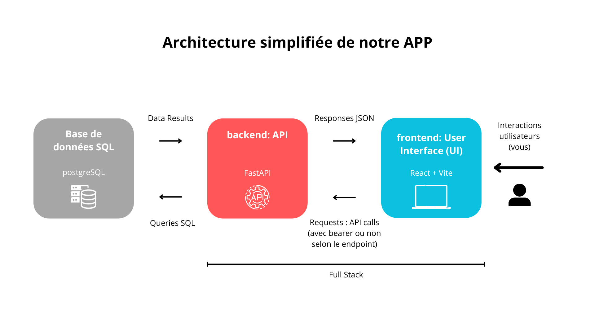
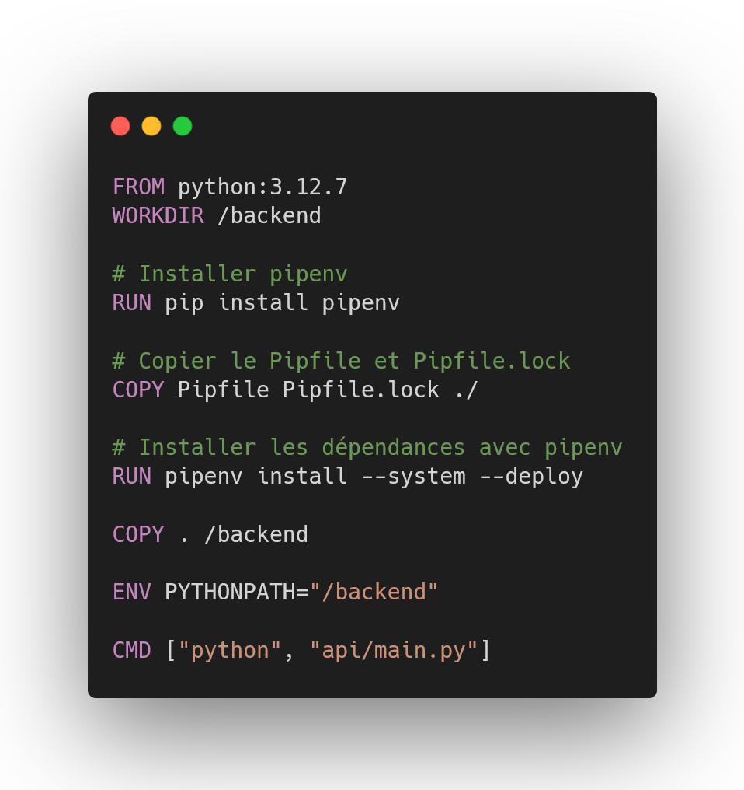
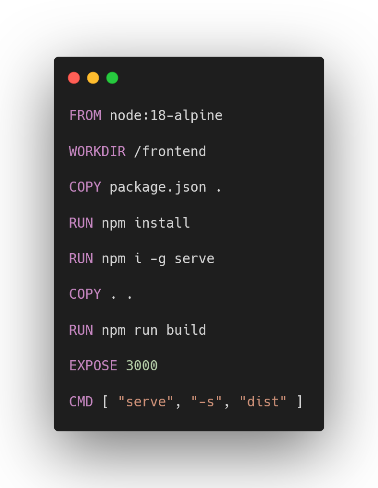

⚠ Disclaimer : this README.md is in French, use translater if needeed

Il y a des balises html dans ce fichier, s'il y a un problème d'affichage, essayez de l'ouvrir ailleurs (e.g. depuis GitHub).

<hr>

# GitHub README
<div style="text-align: center;">
</div>


### 🛠 Outils : 
| **Backend**                                                                                                | **Frontend**                                                                                                                                                                                                                                                                                                 | **Full Stack**                                                                                 |
|------------------------------------------------------------------------------------------------------------|--------------------------------------------------------------------------------------------------------------------------------------------------------------------------------------------------------------------------------------------------------------------------------------------------------------|------------------------------------------------------------------------------------------------|
|  Python             |  TypeScript                                                                                                                                                                                                   |  Docker |
|  FastAPI          |  React +  Vite                                                                                                                   |                                                                                                |
|  PostgreSQL |  PrimeReact +  Bootstrap +  CSS |                                                                                                |

### ☲ Description
Ce projet, réalisé dans le cadre de la matière de 5e année **Fullstack Data**, simule un **réseau social**. Le backend 
est développé avec **FastAPI** en Python, utilisant une base de données **PostgreSQL** pour offrir des points d'**API 
RESTful** permettant de gérer les utilisateurs, les publications et les interactions. Le frontend est construit avec 
**React** et **TypeScript**, en utilisant **Bootstrap** et **PrimeReact** pour les composants UI, assurant ainsi une 
interface moderne et réactive. Ce projet met en évidence l'intégration de technologies Fullstack, avec un 
accent particulier sur la gestion des données, la conception d'API sécurisée et l'architecture d'applications web évolutives.

### 👁 Résultat du projet

**<a href="https://www.pexels.com/fr-fr/">free rights img link<a/>**


<hr>

## Table des matières
### Guide de l’utilisateur
1) [Avant tout](#1---avant-tout) 
2) [Importation](#2---importation) 
3) [Lancer le projet](#3---lancer-le-projet)
4) [Utiliser l'application Web](#4---utiliser-lapplication-web)

### Guide du développeur
1) [Aperçu global](#1---aperçu-global) 
2) [Backend](#2---backend) 
3) [Frontend](#3---frontend)
4) [Continuer le projet](#4---continuer-le-projet)

### Contexte et Retours d'expérience
1) [Pourquoi ce projet](#1---pourquoi-ce-projet) 
2) [Difficultés rencontrées](#2---difficultés-rencontrées) 

<hr>

## Guide de l'utilisateur

### 1 - Avant tout

Dans un premier temps, regardons ce que vous devez installer pour récupérer et utiliser 
le projet.

Deux outils sont nécessaires :
1) **<a href="https://git-scm.com/download" target="_blank">Git</a>** pour cloner le 
   projet depuis le dépôt opensource GitHub.
2) **<a href="https://www.docker.com/products/docker-desktop/" target="_blank">DockerDesktop</a>**
pour faire fonctionner le projet.

Faites une installation classique.

### 2 - Importation

Dans cette partie, nous allons importer le projet disponible sur **GitHub** afin de l’avoir 
sur votre machine (en local).

Pour ce faire, ouvrez le **Git Bash** (vous pouvez le chercher depuis la barre
de recherche de votre système d'exploitation) et rendez-vous dans le dossier où vous désirez stocker
le projet grâce à la commande :
```bash 
$ cd <répertoire désiré>/
```
Lorsque vous êtes dans le dossier voulu, rentrez la commande suivante toujours dans **Git Bash** :
```bash 
$ git clone https://github.com/hugocrt/E5-FullStack_application
```
⚠ Attendez l'importation totale du projet


### 3 - Lancer le projet

Commencez par rejoindre le dossier du projet :
```bash 
$ cd E5-FullStack_application/
```

Une fois que vous êtes bien dans ce répertoire, veuillez lancer l'application docker (e.g. **DockerDesktop** sur Windows).
Elle doit être en fonctionnement pour continuer.

Pour exécuter le projet, il suffit de rentrer la commande suivante dans le **GitBash**.
```bash 
$ docker compose up -d
```

Patientez jusqu'à ce que vous voyiez un groupe de conteneurs apparaître dans votre 
application **docker**. Cela peut prendre une à plusieurs minutes selon votre connexion internet.<br>

⚠ Veillez à ne pas arrêter les services pour le bon fonctionnement de l'application Web.<br><br>
Une fois le service **frontend** en vert, vous pouvez cliquer sur le port souligné en bleu 
*3000 :3000* (voir image ci-dessous) ou bien cliquer sur ce
**<a href="http://localhost:3000" target="_blank">lien</a>**.


### 4 - Utiliser l'application Web

⚠ Premièrement, il est important de noter que l'on utilise une **base de donnée locale**. Par conséquent, vous n'aurez **aucune
donnée pré-enregistrée** lors de votre arrivée sur le réseau social.
Vous pouvez simuler une utilisation en créant plusieurs comptes.
Si vous fermez docker, les données ne seront pas enregistrées (pas d'utilisation de volume).

Le réseau social fonctionne de manière similaire à beaucoup d'autres plateformes : vous pouvez rechercher des 
utilisateurs et voir leurs publications en vous abonnant à eux. Vous avez la possibilité d'aimer et de commenter les 
publications, ainsi que de modifier ou supprimer vos propres commentaires. Vous pouvez également créer vos propres 
publications, les modifier ou les supprimer, et gérer votre compte (mot de passe, nom d'utilisateur, photo de profil, 
etc.) ou même le supprimer si vous le souhaitez.

#### Les différentes pages

Toutes les pages, exceptée celle de connexion, sont munies d'une barre de navigation ainsi que d'un pied de page.

- **Page de connexion**

Il s'agit d'une page standard permettant de s'inscrire ou de se connecter selon vos besoins. En cas d'erreur, un message
d’alerte s'affiche. Vous avez également la possibilité d'afficher ou de masquer le mot de passe.


- **Page d'accueil**

Sur cette page, vous pouvez voir les publications des utilisateurs que vous suivez, avec la possibilité de les liker et 
de les commenter. Vous pouvez aussi afficher une publication individuellement en cliquant sur l'icône en forme d'œil en 
haut à droite de chaque post. Un système de pagination en bas de page permet de charger le contenu progressivement, 
évitant de tout afficher d’un coup.


- **Page de recherches**

Cette page affiche les utilisateurs correspondant à votre recherche effectuée via la barre de recherche. Vous pouvez 
cliquer sur leurs profils pour voir plus d'informations et choisir de les suivre.


- **Page de création de publication**

Page simple permettant de créer une publication en fournissant au minimum un titre. Vous pouvez choisir des images depuis 
votre appareil.


- **Pages de profil**


Il existe deux types de pages de profil. La première concerne votre propre profil : vous pouvez y modifier ou supprimer 
vos publications, supprimer votre compte, ou accéder à la page d'édition de profil. La seconde est celle des autres 
utilisateurs, où vous ne pouvez pas gérer leurs publications, mais vous pouvez choisir de les suivre ou d’arrêter de les
suivre. Dans les deux cas, la photo de profil, la bio, le nombre d'abonnés et d'abonnements, ainsi que les publications 
sont affichés.


- **Page de modification de profil**

Vous avez la possibilité de personnaliser votre profil en modifiant diverses informations. Vous pouvez mettre à jour 
votre photo de profil, changer votre nom d'utilisateur, ajuster votre bio pour refléter vos intérêts ou votre 
personnalité, et, si nécessaire, modifier votre mot de passe pour renforcer la sécurité de votre compte. Ces options
vous permettent de garder votre profil à jour et en adéquation avec vos préférences.


**Bonne exploration sur notre application Web٩(^ᴗ^)۶**
<hr>

## Guide du développeur

### 1 - Aperçu global

Nous avons développé une application **Full Stack** – c’est-à-dire une application qui comprend une partie **backend** (le
serveur) et une partie **frontend** (l'interface utilisateur). Ce type d’architecture permet de séparer les fonctionnalités
de gestion des données et de traitement en arrière-plan des fonctionnalités d’affichage et d'interaction côté
utilisateur ce qui est une approche moderne.

Le projet sera donc structuré en deux grands dossiers : **backend** et **frontend** pour un code modulaire et organisé.

###### Backend

Le backend de notre application est une API (Application Programming Interface). Concrètement, l’API expose des endpoints qui
permettent de gérer des opérations CRUD (Create, Read, Update, Delete) sur les données (user, post, comment, like). Nous avons réalisé l'API à 
l'aide de FastAPI en Python, qui est un framework rapide et récent pour créer des APIs web.

Dans notre cas, il s’agit d’une **API RESTful** pour un réseau social, ce qui signifie que les **endpoints** doivent être
sécurisés pour protéger les données personnelles des utilisateurs. Nous avons mis en place cette sécurité grâce à **HTTP
Bearer** (fourni par FastAPI) et aux **tokens JWT** (JSON Web Tokens). Ces tokens permettent de vérifier l’authenticité de
l’utilisateur lors de chaque requête en ne se connectant qu'une seule fois, améliorant ainsi la sécurité et l'UX. Il existe d'autres méthodes de sécurisation, comme l'utilisation de cookies ou de
services tiers (par exemple **Keycloak** pour la gestion des identités et des accès). Nous avons cependant privilégié HTTP
Bearer et JWT pour leur simplicité et la rapidité de leur implémentation.

En termes de sécurité, d'autres améliorations pourraient être apportées. Par exemple, déployer l’application avec le
protocole **HTTPS** garantirait que les identifiants et mots de passe ne soient pas envoyés en clair, limitant ainsi le
risque d’interception. Nous avons néanmoins sécurisé les mots de passe en les hachant et en les salant dans la base de
données avec le module **CryptContext** de **passlib.context**. De plus, il est important de noter qu'enregistrer de l'ID de
session **SSO** dans le stockage de session du navigateur est un point faible potentiel, car des attaquants pourraient
récupérer cet ID en cas de **faille XSS**.

###### Database

Pour le stockage des données et les opérations de gestion de celles-ci, nous avons utilisé une **base de données SQL**,
**PostgreSQL**. Bien que PostgreSQL soit très performant, nous avons rencontré quelques difficultés comparées à une base
**NoSQL** comme **MongoDB**. Par exemple, pour stocker des images, nous avons utilisé le format **base64** dans la base de données,
bien que cela ne soit pas optimal en raison de la taille des données. L'utilisation de services externes comme
**Cloudinary** aurait été une meilleure option, mais nous avons préféré ne pas intégrer d’API key externe dans notre code
pour des raisons de sécurité et de partage.

###### Frontend

Le frontend a été développé avec **React** et **Vite** en **TypeScript** pour une expérience utilisateur réactive et performante.
Nous avons utilisé **PrimeReact** et **Bootstrap** pour concevoir une interface utilisateur moderne et réactive, tout en
réduisant le temps de développement. La création d'une interface utilisateur est un domaine complexe qui nécessite des
compétences spécifiques, et nous avons donc privilégié ces frameworks pour accélérer le processus et ne pas réinventer la roue.

Pour les appels API, nous avons utilisé **Axios**, une bibliothèque JavaScript permettant de gérer les requêtes HTTP de
manière **asynchrone**. Axios simplifie les appels vers notre API en gérant les promesses et les intercepteurs pour les
erreurs, ce qui améliore la fluidité de l'expérience utilisateur (et développeur).

###### Architecture simplifiée de notre application web



### 2 - Backend

##### Concernant Docker

Comme nous utilisons Docker, nous avons créé un Dockerfile pour cette partie.
Comme c'est un environnement isolé, nous devons installer les packages python nécessaires.
La méthode classique est d'utiliser un requirements.txt. Cependant, une approche plus professionnelle est d'utiliser un 
Pipfile. C'est donc ce que nous avons fait. Nous installons donc nos dépendances grâce pipenv et notre Pipfile/Pipfile.lock

###### Dockerfile


##### Concernant le code

Premièrement, si le projet est actuellement en train de fonctionner dans Docker, vous pouvez cliquer ici
**<a href="http://localhost:5000/docs">lien FastAPI docs<a/>** pour voir tous les **endpoints** créés. Vous verrez également
lesquels sont sécurisés à l'aide du symbol cadena.

Nous rappelons qu'une bonne pratique en programmation consiste à créer un code modulaire afin de faciliter le débogage, 
de limiter les dépendances entre les différentes parties du code et de favoriser une approche évolutive.
Nous avons ainsi décidé de suivre le découpage utilisé dans le cours :


###### Structure du dossier backend
````bash
C:.
├───api
│   ├───models
│   │   └───__pycache__
│   ├───routes
│   │   └───__pycache__
│   ├───schemas
│   │   └───__pycache__
│   ├───services
│   │   └───__pycache__
│   └───__pycache__
├───tests
└───__pycache__
````

Chaque dossier comprend ses fichiers python user, post, etc. De cette manière, si l'on veut uniquement changer une route
de notre API user, on se rend dans le dossier routes puis dans le fichier user.py.

Ici l'intérêt n'étant pas de faire un cours, nous vous invitons à regarder les codes directement pour plus de détails.

### 3 - Frontend

##### Concernant Docker

Nous avons également créé un Dockerfile pour le frontend.
Comme c'est toujours un environnement isolé, nous devons une fois encore installer les packages nécessaires.
Merci à **Dhruv Patel** pour son tutoriel **<a href="https://thedkpatel.medium.com/dockerizing-react-application-built-with-vite-a-simple-guide-4c41eb09defa" target="_blank">
Dockerizing React Application Built with Vite : A Simple Guide</a>**.


###### Dockerfile


##### Concernant le code

La structure des dossiers de l'application React est conçue pour organiser le code de manière claire et modulaire. Le
dossier public contient les fichiers statiques accessibles par le navigateur, comme les images. Dans src, on trouve les
sous-dossiers : APIServices pour les appels API, assets pour les ressources comme les CSS, components pour les
composants réutilisables (comme un Loader, etc), layout qui a un fichier base et qui comme son nom l'indique sert de
base aux différentes pages (par exemple, on trouve le footer et la navbar sur toutes les pages) diminuant ainsi la
duplication de code, et pages pour les différentes pages. Enfin, type est utilisé pour les types TypeScript (User, Post, etc). 
Cette organisation facilite la gestion du code, le rend évolutif et permet une réutilisation optimale des différentes 
parties de l'application.

###### Structure du dossier frontend
````bash
C:.
├───public
└───src
    ├───APIServices
    ├───assets
    │   └───css
    ├───components
    ├───layout
    ├───pages
    └───type
````

On ne s'attardera pas non plus sur les codes. Cependant, voici l'App.tsx

###### Extrait de code d'App.tsx


On voit que l'on a protégé l'accès aux différentes pages, vous devez vous connecter ou vous s'inscrire pour y accéder.

### 4 - Continuer le projet

Comme mentionné plus tôt, il y a plusieurs axes d'amélioration possibles, notamment en termes de sécurité. Par exemple,
il serait important de mettre en place HTTPS pour sécuriser les communications et éviter que des informations sensibles
comme les identifiants ou mots de passe soient envoyées en clair. De plus, il serait préférable de ne pas stocker le
token SSO dans la session storage, car cela pourrait représenter un risque de sécurité.

Côté interface utilisateur, on pourrait prévoir des améliorations comme le recadrage des images et d’autres
transformations pour optimiser leur affichage. 
On pourrait également mettre en place un système de notification : nouvelle publication, abonnement....

Enfin, il existe plein de fonctionnalités intéressantes qu’on pourrait ajouter, inspirées de ce qu’on trouve sur les
grandes plateformes sociales. Par exemple, un système de recommandations de publications qui suggérerait des contenus en
fonction des préférences des utilisateurs, de leur activité ou de leur historique. Cela ajouterait une dimension plus
interactive et personnalisée à l’application.

**Bon code ٩(^ᴗ^)۶**

<hr>

## Contexte et Retours d'expérience

Voici les consignes du projet :

````text
Vous devez fournir un readme expliquant le sujet choisi, les difficultés rencontrées ainsi qu’une petite explication sur le lancement de 
l’application.
 
Critères d’évaluation :
 
Le projet doit se lancer intégralement avec docker compose
Le projet doit contenir au moins deux services.
Une API écrite en python avec FastAPI
Une base de données Postgresql
La base de données contiendra une table User
Un système d’authentification devra être mis en place
Soit un simple système comme vu en cours
Récupération d’un JWT à l’aide d’un username / password
Soit avec le système d’authentification Keycloak
Au moins un endpoint d’API sécurisé à l’aide d’une authentification JWT
````

### 1 - Pourquoi ce projet

Nous avons rapidement opté pour un **réseau social**, car ce choix répondait parfaitement aux contraintes du projet tout en
nous permettant de travailler sur un cas concret et actuel. Ce type de projet exige une attention particulière à
l'**interface utilisateur**, ce qui nous a poussés à réfléchir à l’**ergonomie** et à l’**interactivité** de l’application. De plus,
nous voulions nous concentrer sur la construction d'une application fullstack complète, et non sur la récupération de
données en ligne, car c’est un aspect que nous avions déjà abordé l’année dernière.

### 2 - Difficultés rencontrées

Sur le plan technique, quelques difficultés se sont présentées. Comme mentionné, la gestion des images a été un défi,
car le choix de les encoder en base64 n’était pas idéal. Un autre défi majeur a été notre **découverte** de **React** et du
**TypeScript**, que nous utilisions pour la première fois. Bien que ce soit notre première expérience avec ces technologies,
nos bases en programmation, acquises dans d'autres langages comme en **Java** et en **C**, nous ont bien aidés à les appréhender.

Cela dit, nous sommes conscients que notre code pourrait ne pas respecter toutes les conventions de ces outils, étant
donné que nous les avons appris en autodidactes dans un délai limité. Malgré cela, cette expérience a été très
enrichissante et a considérablement renforcé notre compréhension du développement d’une application web (voire mobile).

Merci du temps que vous avez consacré à cette lecture.