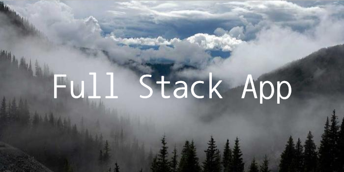
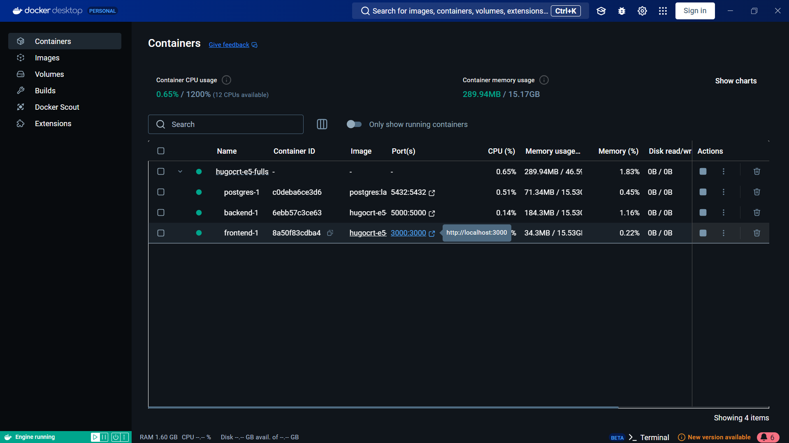
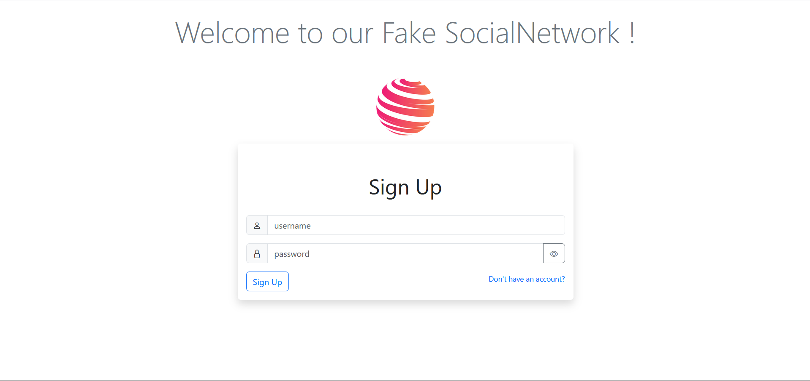
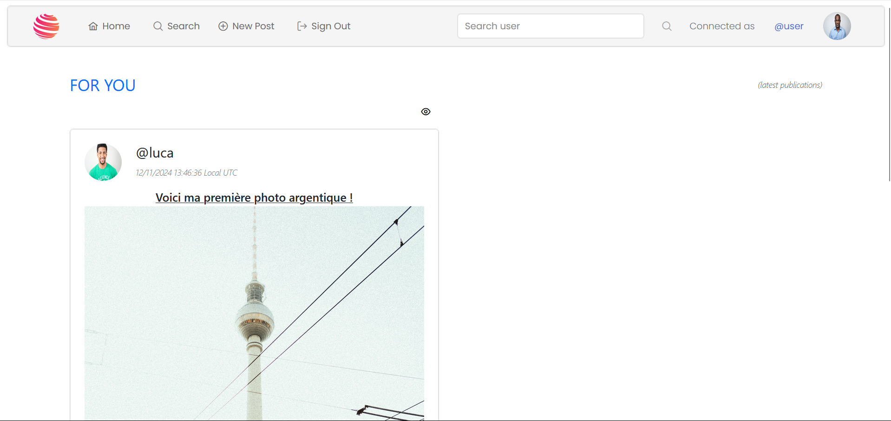
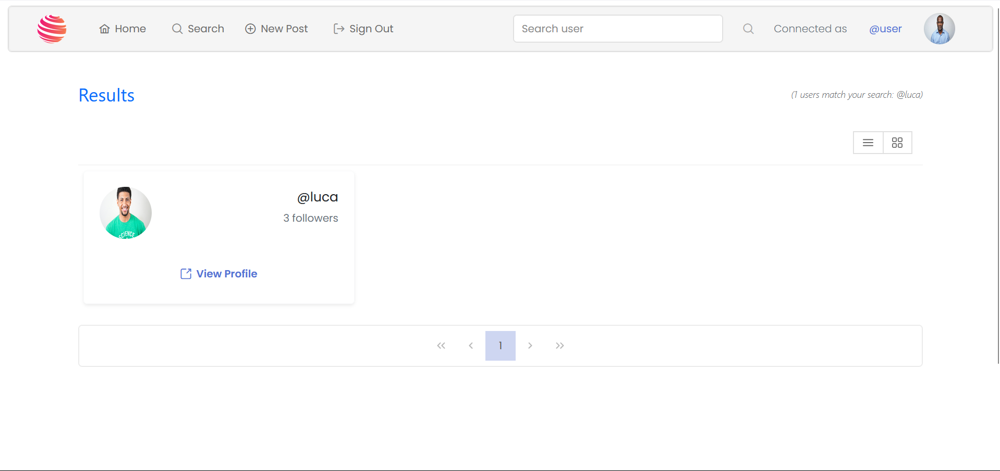
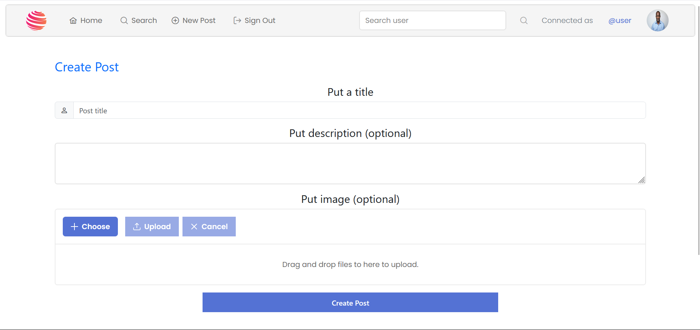
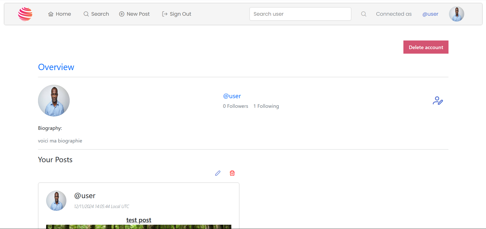
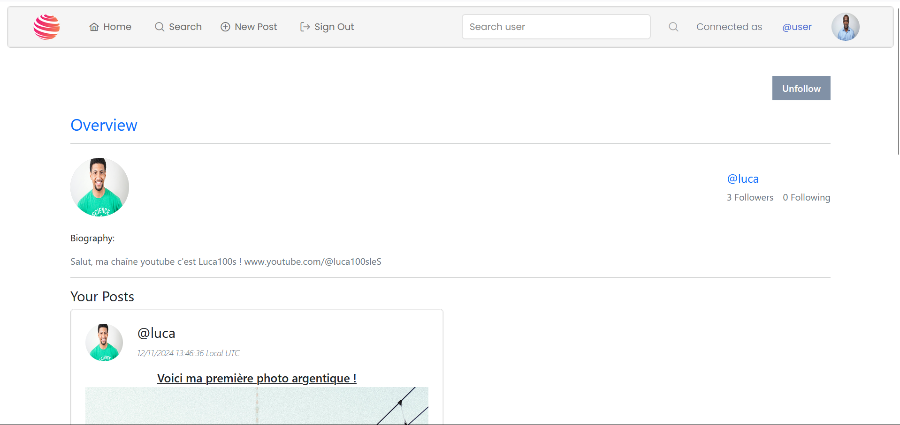
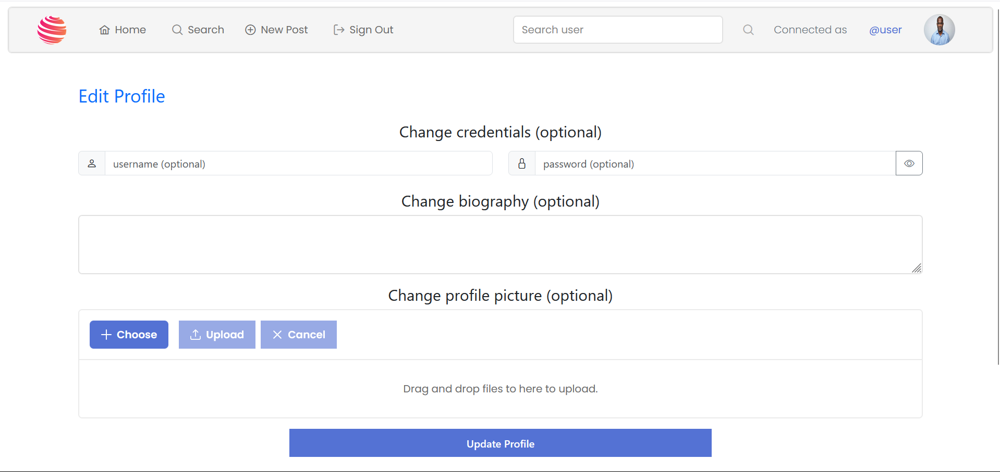

⚠ Disclaimer : this README.md is in French, use translater if needeed

Il y a des balises html dans ce fichier, s'il y a un problème d'affichage, essayez de l'ouvrir ailleurs (e.g. depuis GitHub).

<hr>

# GitHub README
<div style="text-align: center;">
</div>


### 🛠 Outils : 
| **Backend**                                                                                                                                                                                                                                                                                                                 | **Frontend**                                                                                                                                                                                                                                                                                                                                                                                                                                                                                                                                                                                                                       | **Full Stack**                                                 |
|-----------------------------------------------------------------------------------------------------------------------------------------------------------------------------------------------------------------------------------------------------------------------------------------------------------------------------|------------------------------------------------------------------------------------------------------------------------------------------------------------------------------------------------------------------------------------------------------------------------------------------------------------------------------------------------------------------------------------------------------------------------------------------------------------------------------------------------------------------------------------------------------------------------------------------------------------------------------------|----------------------------------------------------------------|
| -  Python <br> -  FastAPI <br> -  PostgreSQL | -  TypeScript <br> -  React +  Vite <br> -  PrimeReact +  Bootstrap +  CSS |  Docker |

### ☲ Description
Ce projet, réalisé dans le cadre de la matière de 5e année **Fullstack Data**, simule un **réseau social**. Le backend 
est développé avec **FastAPI** en Python, utilisant une base de données **PostgreSQL** pour offrir des points d'**API 
RESTful** permettant de gérer les utilisateurs, les publications et les interactions. Le frontend est construit avec 
**React** et **TypeScript**, en utilisant **Bootstrap** et **PrimeReact** pour les composants UI, assurant ainsi une 
interface moderne et réactive. Ce projet met en évidence l'intégration de technologies Fullstack, avec un 
accent particulier sur la gestion des données, la conception d'API sécurisée et l'architecture d'applications web évolutives.

### 👁 Résultat du projet

**<a href="https://www.pexels.com/fr-fr/">free rights img link<a/>**


<hr>

## Table des matières
### Guide de l’utilisateur
1) [Avant tout](#1---avant-tout) 
2) [Importation](#2---importation) 
3) [Lancer le projet](#3---lancer-le-projet)
4) [Utiliser l'application Web](#4---utiliser-lapplication-web)

### Guide du développeur
1) [Logique du projet](#1-logique-du-projet) 
    - [Structure du projet](#structure-du-projet)
    - [D'un point de vue global](#dun-point-de-vue-global)
    - [D'un point de vue plus approfondi](#dun-point-de-vue-plus-approfondi)
        - [Gestion des packages Python](#gestion-des-packages-python)
        - [Conception de deux images Docker](#conception-de-deux-images-docker)
        - [Codes Python](#codes-python)
3) [Continuer le projet](#3---continuer-le-projet)

### Contexte et Retours d'expérience
1) [Pourquoi ce projet](#1-logique-du-projet) 
2) [Difficultés rencontrées](#1-logique-du-projet) 

<hr>

## Guide de l'utilisateur

### 1 - Avant tout

Dans un premier temps, regardons ce que vous devez installer pour récupérer et utiliser 
le projet.

Deux outils sont nécessaires :
1) **<a href="https://git-scm.com/download" target="_blank">Git</a>** pour cloner le 
   projet depuis le dépôt opensource GitHub.
2) **<a href="https://www.docker.com/products/docker-desktop/" target="_blank">DockerDesktop</a>**
pour faire fonctionner le projet.

Faites une installation classique.

### 2 - Importation

Dans cette partie, nous allons importer le projet disponible sur **GitHub** afin de l’avoir 
sur votre machine (en local).

Pour ce faire, ouvrez le **Git Bash** (vous pouvez le chercher depuis la barre
de recherche de votre système d'exploitation) et rendez-vous dans le dossier où vous désirez stocker
le projet grâce à la commande :
```bash 
$ cd <répertoire désiré>/
```
Lorsque vous êtes dans le dossier voulu, rentrez la commande suivante toujours dans **Git Bash** :
```bash 
$ git clone https://github.com/hugocrt/E5-FullStack_application
```
⚠ Attendez l'importation totale du projet


### 3 - Lancer le projet

Commencez par rejoindre le dossier du projet :
```bash 
$ cd E5-FullStack_application/
```

Une fois que vous êtes bien dans ce répertoire, veuillez lancer l'application docker (e.g. **DockerDesktop** sur Windows).
Elle doit être en fonctionnement pour continuer.

Pour exécuter le projet, il suffit de rentrer la commande suivante dans le **GitBash**.
```bash 
$ docker compose up -d
```

Patientez jusqu'à ce que vous voyiez un groupe de conteneurs apparaître dans votre 
application **docker**. Cela peut prendre une à plusieurs minutes selon votre connexion internet.<br>

⚠ Veillez à ne pas arrêter les services pour le bon fonctionnement de l'application Web.<br><br>
Une fois le service **frontend** en vert, vous pouvez cliquer sur le port souligné en bleu 
*3000 :3000* (voir image ci-dessous) ou bien cliquer sur ce
**<a href="http://localhost:3000" target="_blank">lien</a>**.



### 4 - Utiliser l'application Web

⚠ Premièrement, il est important de noter que l'on utilise une **base de donnée localement**. Par conséquent, vous n'aurez **aucune
donnée pré-enregistrée** lors de votre arrivée sur le réseau social.
Vous pouvez simuler une utilisation en créant plusieurs comptes.
Si vous fermez docker, les données ne seront pas enregistrées (pas d'utilisation de volume).

Le réseau social fonctionne de manière similaire à beaucoup d'autres plateformes : vous pouvez rechercher des 
utilisateurs et voir leurs publications en vous abonnant à eux. Vous avez la possibilité d'aimer et de commenter les 
publications, ainsi que de modifier ou supprimer vos propres commentaires. Vous pouvez également créer vos propres 
publications, les modifier ou les supprimer, et gérer votre compte (mot de passe, nom d'utilisateur, photo de profil, 
etc.) ou même le supprimer si vous le souhaitez.

#### Les différentes pages

Toutes les pages, exceptée celle de connexion, sont munies d'une barre de navigation ainsi que d'un pied de page.

- **Page de connexion**

Il s'agit d'une page standard permettant de s'inscrire ou de se connecter selon vos besoins. En cas d'erreur, un message
d’alerte s'affiche. Vous avez également la possibilité d'afficher ou de masquer le mot de passe.


- **Page d'accueil**

Sur cette page, vous pouvez voir les publications des utilisateurs que vous suivez, avec la possibilité de les liker et 
de les commenter. Vous pouvez aussi afficher une publication individuellement en cliquant sur l'icône en forme d'œil en 
haut à droite de chaque post. Un système de pagination en bas de page permet de charger le contenu progressivement, 
évitant de tout afficher d’un coup.


- **Page de recherches**

Cette page affiche les utilisateurs correspondant à votre recherche effectuée via la barre de recherche. Vous pouvez 
cliquer sur leurs profils pour voir plus d'informations et choisir de les suivre.


- **Page de création de publication**

Page simple permettant de créer une publication en fournissant au minimum un titre. Vous pouvez choisir des images depuis 
votre appareil.


- **Pages de profil**


Il existe deux types de pages de profil. La première concerne votre propre profil : vous pouvez y modifier ou supprimer 
vos publications, supprimer votre compte, ou accéder à la page d'édition de profil. La seconde est celle des autres 
utilisateurs, où vous ne pouvez pas gérer leurs publications, mais vous pouvez choisir de les suivre ou d’arrêter de les
suivre. Dans les deux cas, la photo de profil, la bio, le nombre d'abonnés et d'abonnements, ainsi que les publications 
sont affichés.


- **Page de modification de profil**

Vous avez la possibilité de personnaliser votre profil en modifiant diverses informations. Vous pouvez mettre à jour 
votre photo de profil, changer votre nom d'utilisateur, ajuster votre bio pour refléter vos intérêts ou votre 
personnalité, et, si nécessaire, modifier votre mot de passe pour renforcer la sécurité de votre compte. Ces options
vous permettent de garder votre profil à jour et en adéquation avec vos préférences.


**Bonne exploration sur notre application Web٩(^ᴗ^)۶**
<hr>

## Guide du développeur

**<a href="http://localhost:5000/docs">lien FastAPI docs<a/>**

<hr>

## Contexte et Retours d'expérience
